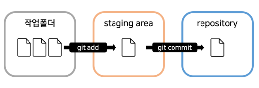

# Git

### Git 설치

* window의 경우 git for window 검색 후 설치
* mac의 경우 터미널에서 brew install git&#x20;
* 설치시 기본 에디터가 vim으로 설정 되어 있으면 VScode로 에디터 변경
* 기본 브랜치 이름 main으로 설정

### 작업 폴더 생성

1. 터미널 생성 후 작업 폴더 오픈
2. git 버전 체크 : git --version
3. 2024년 1월 기준 현재 버전 : git version 2.43.0.windows.1

### git config 설정

1. 이메일 설정 : git config --global use.email "사용자 이메일"
2. 유저 이름 설정 : git config --global user.name "사용자 이름"

***

### git init

1. 터미널 오픈&#x20;
2. git init

### git add\&commit

<figure><figcaption></figcaption></figure>

1. git add
   * commit의 전단계로 untracked 파일을 tracked 파일로 변경
   * git add "파일 명"
   * git add "파일명 1" "파일명2" // 동시 스테이징 가smd
   * git add . // 작업 폴더의 모든 파일을 스테이징
2. git commit&#x20;
   * git에 저장하는 단계
   * git commit -m "메세지"
3. staging area
   * commit 할 파일을 올려두는 임시 저장소
   * staging area에 파일을 넣는 행위를 staging이라고 함
4. repository&#x20;
   * commit된 파일의 버전들을 모아 놓는 저장소
   * .git 아래에 repository 존재

### git status

1. git의 현재 상태, 변경된 파일과 스테이징된 파일 목록 반환
2. git status

### git restore&#x20;

1. 스테이징된 파일을 취소하고 싶은 경우
2. git restore --staged "파일명"

### git log&#x20;

1. commit 기록을 한 눈에 파악하고 싶을 때 사용하는 명령어
2. git log --all --oneline
3. git log --all --oneline --graph // log 그래프로 제공

### git diff

1. 바로 전 commit과 현재 코드의 차이점을 비교&#x20;
2. 현재 파일이 최근 commint과 어떤 부분이 달라졌는지 확인 가능
3. git diff "커밋 id" //과거 특정 commit과 현재 파일을 비교하고 싶은 경우

### git difftool

1. git difftool // 현재 파일과 최근 commit의 차이점을 비
2. git difftool "커밋 id" // 현재 파일과 특정 commit의 차이점을 비교
3. git difftool "커밋id 1" "커밋id2" // 특정 commit 2개의 차이점을 비교

***

### git branch

1. git branch "브랜치 이름" // 브랜치 생성
2. git switch "브랜치 이름" // 브랜치 변경
3. git log --graph --oneline --all // 브랜치와 커밋 내용을 한눈에 보고 싶을 경우
4. git merge "브랜치 이름" // 브랜치 합치기

***

### git restore

1. git restore "파일 이름" // 최근 commit으로 파일 상태 되돌리기
2. git restore --source "커밋 아이디" // 특정 커밋 아이디 시점으로 파일 상태 되돌리기
3. git restore --staged "파일 이름" // 특정 파일의 staging 취소하기

### git revert

1. git revert "커밋 아이디" // 특정 커밋 아이디에서 일어난 커밋 취소
2. git revert HEAD // 최근 커밋 1개 revert

### git reset

1. git rest --hard  "커밋 아이디" // 특정 커밋이 생성된 시점으로 되돌리기
2. git rest --soft "커밋 아이디" // staging area에 남아 있음
3. git rest --mixde "커밋 아이디" // staging 이전의 상태로, git add나 git commit 가능

