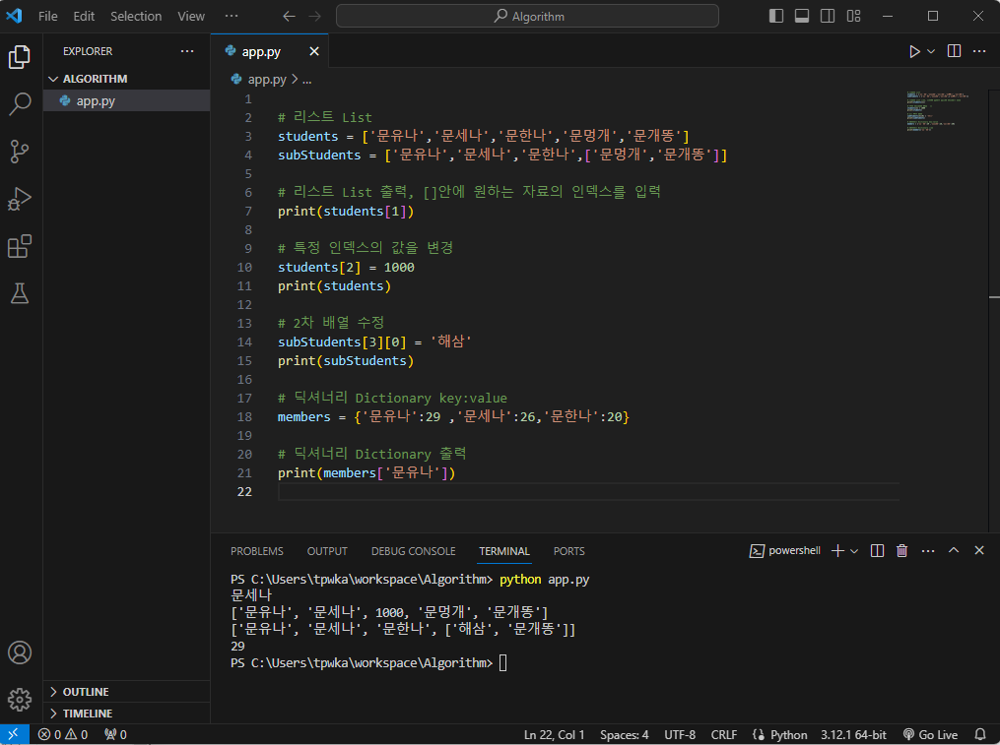

# Python 기초 문법

### 문자와 변수

```python

# 출력
print(123)
print('문유나')
print("문유나")

# 연산
print(123+456)
print(100*100)

# 변수
name = "문유나"
print(name)

# 인덱스
name = "가나다라마바사"
print(name[0])
print(name[0:3])
 
```

### 문자와 변수 결과

<figure><figcaption></figcaption></figure>

***

### 리스트/딕셔너리

```python

# 리스트 List
students = ['문유나','문세나','문한나','문멍개','문개똥']
subStudents = ['문유나','문세나','문한나',['문멍개','문개똥']]

# 리스트 List 출력, []안에 원하는 자료의 인덱스를 입력
print(students[1])

# 특정 인덱스의 값을 변경
students[2] = 1000
print(students)

# 2차 배열 수정 
subStudents[3][0] = '해삼'
print(subStudents)

# 딕셔너리 Dictionary key:value
members = {'문유나':29 ,'문세나':26,'문한나':20}

# 딕셔너리 Dictionary 출력
print(members['문유나'])

```

### 리스트/딕셔너리 테스트 결과&#x20;

<figure><figcaption></figcaption></figure>

***

