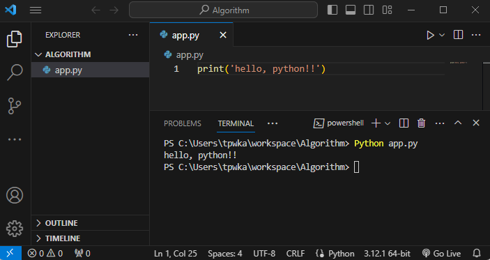

# Python 개발 환경 세팅

### [Python 설치](https://www.python.org/downloads/)

* 2024.01 기준 3.12.1 v설치
* 윈도우의 경우 **PATH에 등록하기 체크하고** 설치하시면 됩니다.&#x20;

### VScode 실행

* 파일경로orkspace/algorithm&#x20;

### 환경 변수 설정

* AppData > python 및 python/script 경로 복사
* 시스템 고급 설정 > 환경 변수 > 시스템 변수&#x20;
* path 편집 > 새로 만들기
* 위에서 복사한 경로 2개 등

### 테스트 코드 실행

* app.py 생성
* 터미널 오픈
* python 파일명&#x20;

### 테스트 코드 실행 결과

<figure><figcaption></figcaption></figure>

