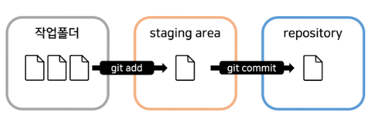

# Git

### [git 설치](https://gitforwindows.org/)

* 설치시 기본 에디터가 vim으로 설정 되어 있으면 VScode로 에디터 변경
* 기본 브랜치 이름 main으로 설정

### 작업 폴더 생성

1. 터미널 생성 후 작업 폴더 오픈
2. git 버전 체크 : git --version
3. 2024년 1월 기준 현재 버전 : git version 2.43.0.windows.1

### git config 설정

1. 이메일 설정 : git config --global use.email "사용자 이메일"
2. 유저 이름 설정 : git config --global user.name "사용자 이름"

***

### git init

1. 터미널 오픈&#x20;
2. git init

### git add\&commit

<figure><figcaption></figcaption></figure>

1. git add
   * commit의 전단계로 untracked 파일을 tracked 파일로 변경
   * git add "파일 명"
   * git add "파일명 1" "파일명2" // 동시 스테이징 가smd
   * git add . // 작업 폴더의 모든 파일을 스테이징
2. git commit&#x20;
   * git에 저장하는 단계
   * git commit -m "메세지"
3. staging area
   * commit 할 파일을 올려두는 임시 저장소
   * staging area에 파일을 넣는 행위를 staging이라고 함
4. repository&#x20;
   * commit된 파일의 버전들을 모아 놓는 저장소
   * .git 아래에 repository 존재

### git status

1. git의 현재 상태, 변경된 파일과 스테이징된 파일 목록 반환
2. git status

### git restore&#x20;

1. 스테이징된 파일을 취소하고 싶은 경우
2. git restore --staged "파일명"

### git log&#x20;

1. commit 기록을 한 눈에 파악하고 싶을 때 사용하는 명령어
2. git log --all --oneline
3. git log --all --oneline --graph // log 그래프로 제공
4.

